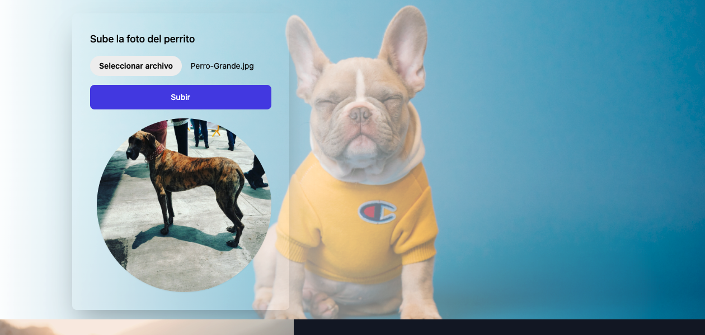

<div align="center" id="top">
  

&#xa0;

  <a href="https://doogstore.netlify.app">Demo</a>
</div>

<h1 align="center">DogStore</h1>

<p align="center">
  

  

  

  

  

  

  

  
</p>

<!-- Status -->

<h4 align="center">
	🚧  DogStore 🚀 Finish  🚧
</h4>

<hr>

<p align="center">
  <a href="#dart-about">About</a> &#xa0; | &#xa0; 
  <a href="#sparkles-features">Features</a> &#xa0; | &#xa0;
  <a href="#rocket-technologies">Technologies</a> &#xa0; | &#xa0;
  <a href="#white_check_mark-requirements">Requirements</a> &#xa0; | &#xa0;
  <a href="#checkered_flag-starting">Starting</a> &#xa0; | &#xa0;
  <a href="#memo-license">License</a> &#xa0; | &#xa0;
  <a href="https://github.com/SoterRamirez" target="_blank">Isaí Ramírez</a>
</p>

<br>

## :dart: About

Consumo de API Rest de Perritos, ver, guardar y subir fotos a la Api.

## :sparkles: Features

:heavy_check_mark: Tailwind;\
:heavy_check_mark: Responsive;\
:heavy_check_mark: API REST;

## :rocket: Images

<p align="center">
  
  
</p>

## :rocket: Technologies

The following tools were used in this project:

- [Expo](https://expo.io/)
- [Node.js](https://nodejs.org/en/)
- [React](https://pt-br.reactjs.org/)
- [React Native](https://reactnative.dev/)
- [TypeScript](https://www.typescriptlang.org/)

## :white_check_mark: Requirements

Before starting :checkered_flag:, you need to have [Git](https://git-scm.com) and [Node](https://nodejs.org/en/) installed.

## :checkered_flag: Starting

```bash
# Clone this project
$ git clone https://github.com/SoterRamirez/dogstore

# Access
$ cd dogstore

# Install dependencies
$ npm install

# Run the project
$ npm run tw:build

# Build Project
$ npm run tw:pro

# The server will initialize in the <http://localhost:3000>
```

## :memo: License

This project is under license from MIT. For more details, see the [LICENSE](LICENSE.md) file.

Made with :heart: by <a href="https://github.com/SoterRamirez" target="_blank">Isaí Ramírez</a>

&#xa0;

<a href="#top">Back to top</a>
